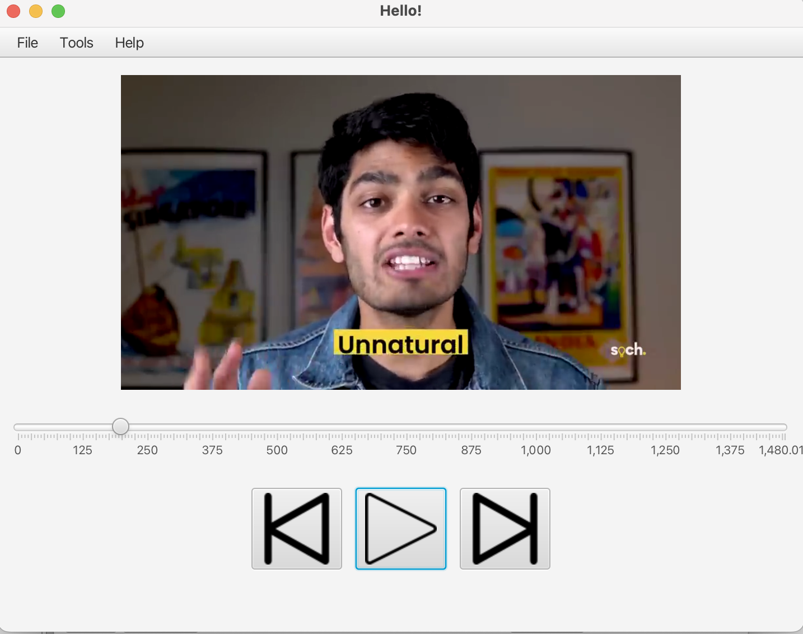

# VideoPlayer

  

used Java Fx to Create Video VideoPlayer

  

Tech Stack

Core Java

Java Fx

SceneBuilder

  

Functionality Added

1.Play

2.Pause

3.Select Different files 

4.Skip for 10 sec

5.Back for 10 sec

File chooser and Media is used to select media and play the file.
